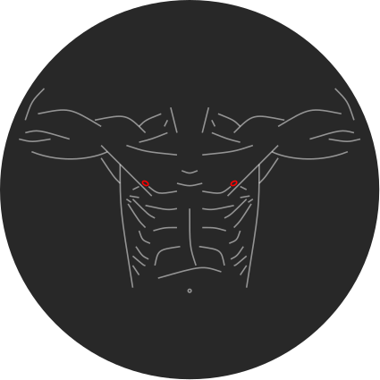

# shtlogo

[![GPL licensed][license-badge]][license-url]

[license-badge]: https://img.shields.io/badge/license-GPL-blue.svg
[license-url]: ./LICENSE

Logos written in TIKZ and compiled to SVG.

## bullSHTbody

<figure>
  
</figure>
